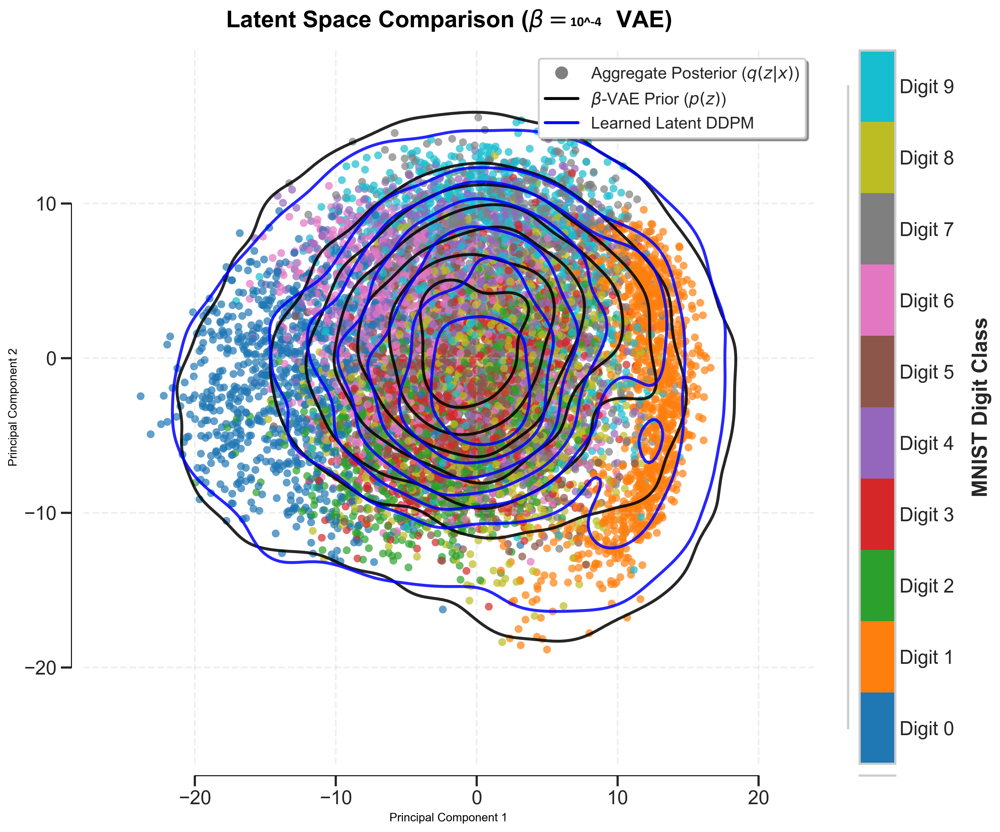
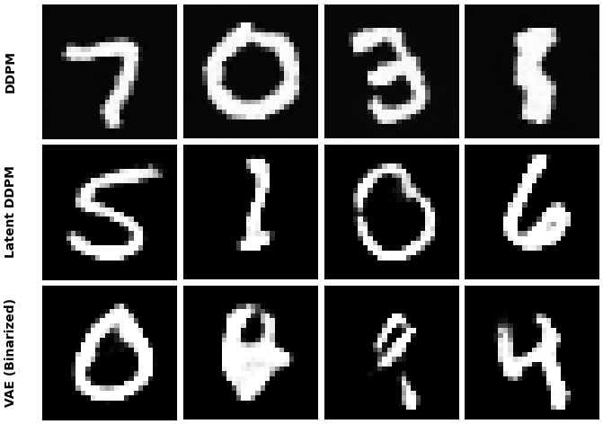

# Advanced Machine Learning - Project 1: VAEs and DDPMs

This project explores and compares two types of generative models: Variational Autoencoders (VAEs) and Denoising Diffusion Probabilistic Models (DDPMs) on the MNIST dataset.

## Introduction
This repository is the submission for the 1st mini project of the class Advanced Machine Learning at the Technical University of Denmark. The associated report can be found at [02460_AML_Project1.pdf](02460_AML_Project1.pdf).


## Getting Started

### Prerequisites

*   Python 3.x
*   PyTorch

### Installation

1.  Clone the repository:
    ```bash
    git clone <repository-url>
    cd 02460_AML_Project1
    ```

2.  Install the required packages:
    ```bash
    pip install -r requirements.txt
    ```

## Usage

### Variational Autoencoders (VAEs)

The `vae.py` script is the main script for training and evaluating VAEs. The `vae_runner.py` and `beta_vae_runner.py` scripts are provided as convenience wrappers for running experiments.

**Running a single VAE:**

To train and evaluate a VAE with a specific prior, you can use the `vae.py` script directly:

```bash
# Train a VAE with a Gaussian prior
python vae.py train --prior gaussian --model model_gaussian.pt --epochs 10

# Test the trained VAE
python vae.py test --prior gaussian --model model_gaussian.pt
```

**Benchmarking VAEs with different priors:**

The `vae_runner.py` script can be used to benchmark VAEs with different priors (`gaussian`, `mog`, `flow`).

```bash
python vae_runner.py --prior gaussian --runs 5
```

This will train and test a VAE with a Gaussian prior 5 times with different random seeds and save the results in the `results_gaussian` directory.

**Hyperparameter search for Beta-VAEs:**

The `beta_vae_runner.py` script can be used to perform a hyperparameter search for the `beta` parameter in a Beta-VAE.

```bash
python beta_vae_runner.py --prior gaussian --betas 1e-6 1e-4 1e-2 0.1
```

This will train and test a Beta-VAE with a Gaussian prior for each of the specified beta values and save the results in the `results_beta_gaussian` directory.

### Denoising Diffusion Probabilistic Models (DDPMs)

The `ddpm_run.py` script is used for training and sampling from DDPMs.

**Training a DDPM on MNIST:**

```bash
python ddpm_run.py train --model model_ddpm.pt --device cuda --epochs 100 --batch-size 64 --network unet --lr 1e-3
```

**Sampling from a trained DDPM:**

```bash
python ddpm_run.py sample --model model_ddpm.pt --device cuda --samples sample_ddpm.png
```

**Training a DDPM on the latent space of a Beta-VAE:**

```bash
python ddpm_run.py train --model model_ddpm_bvae_unet.pt --beta-vae results_beta_flow/model_flow_beta_1e-06.pt --device cuda --epochs 100 --batch-size 64 --lr 1e-3 --network unet
```

**Sampling from a latent space DDPM:**

```bash
python ddpm_run.py sample --model model_ddpm_bvae_unet.pt --beta-vae results_beta_flow/model_flow_beta_1e-06.pt --device cuda --samples sample_ddpm_bvae_unet.png
```

## File Descriptions

*   `vae.py`: Main script for training and evaluating VAEs.
*   `vae_runner.py`: Convenience script for benchmarking VAEs with different priors.
*   `beta_vae_runner.py`: Convenience script for hyperparameter search for Beta-VAEs.
*   `ddpm.py`: Implementation of the DDPM model.
*   `ddpm_models.py`: Contains the network architectures for the DDPMs.
*   `ddpm_run.py`: Main script for training and sampling from DDPMs.
*   `ddpm_beta.py`: Script for training and evaluating DDPMs in the latent space of a Beta-VAE.
*   `flow.py`: Implementation of normalizing flows for the VAE prior.
*   `MNIST.py`: Dataloader for the MNIST dataset.
*   `fid.py`: Script for calculating the Fréchet Inception Distance (FID).
*   `plotting.py`: Script for generating plots.
*   `utils.py`: Utility functions.
*   `requirements.txt`: List of required Python packages.
*   `README.md`: This file.

## Results

### Latent Space Comparison


### Model Samples

